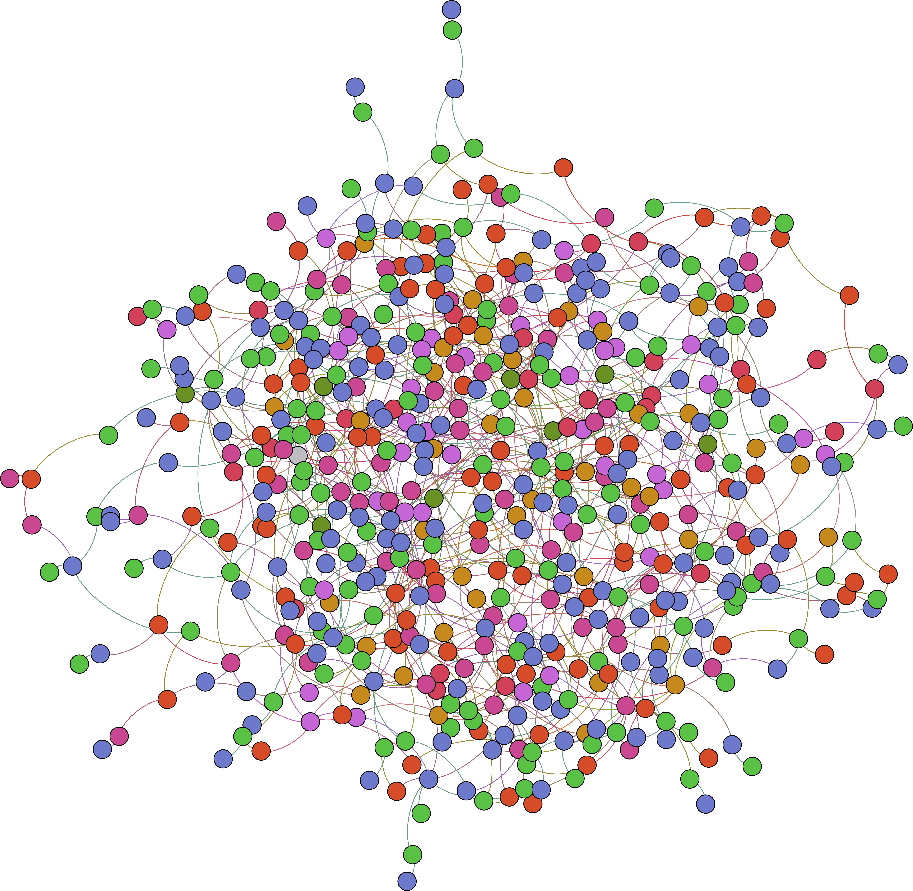

# Molecular Association Network (MAN) -- version v1.0
#### A molecular association network that contains 5 kinds of molecules, 9 types of associations, 6,528 nodes, 105,546 molecular associations.  
  
The associations among lncRNAs, miRNAs, proteins, drugs, and diseases, including 16,427 miRNA-disease associations, 18,416 drug-disease interactions, 627 lncRNA-protein interactions, 8,374 miRNA-lncRNA interactions, 4,944 miRNA-protein interactions, 1,264 lncRNA-disease interactions, 19,237 protein-protien interactions, 25,087 protein-disease interactions, and 11,107 drug-protein interactions.
